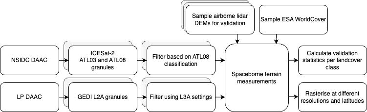

# Validation
Scripts used for the validation paper, using SpaceLiDAR.jl

- `generate.jl` for downloading and generating all ICESat-2 and GEDI files in an area of interest and convert them to .pq files
- `sample.jl` for sampling DTMs and landcover maps, again saving to the .pq files
- `stats.jl` for aggregating all sampled information and calculation of statistics
- `rasterize.jl` for generating grids at different resolutions and latitudes

## Overview

